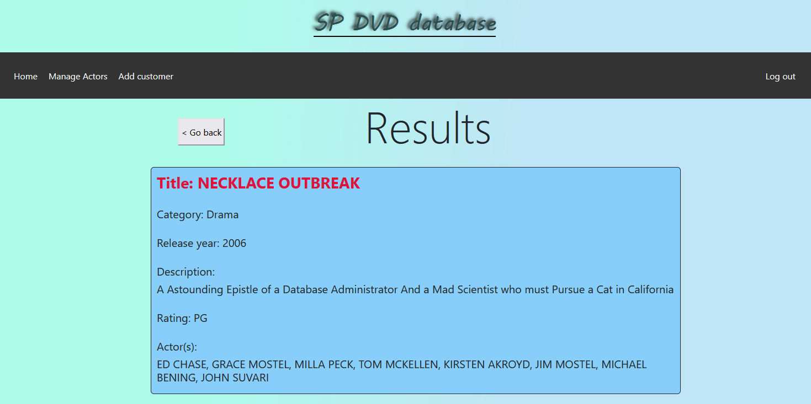

# SP DVD Store Website

This project is done as my submission for the Back-End Development CA2 assignment from Singapore Polytechnic AY22/23. 
This is a full-stack project which consists of a front-end web server to serve webpages and a back-end server to query with the database. 

The front-end is built with React. And the back-end is powered by expressjs. 
This project also consists of a MySQL database where all the data are stored and be able to interact with on the front-end, 
but I can't just somehow lump a database into github, so there will be an SQL script in this directory for anyone reading this to build their own database first and then write the data. 
Without the database, the website is merely useless, and you can only look at the home page.

Note: The project is setup such that everything runs locally, including the client. Server hosting is only done on my later school project.

## Screenshots

Since it will be troublesome to setup a MySQL database and run the script, here are some screenshots of the website in action:

Home page while logged out:

Home page while logged in:

Login page:

Search film result page:

Film detail page:

Actor management page:

## Instructions written for assignment submission
(Delete any existing bed_dvd_db schema before running the SQL script)
Follow the instructions to get started:
1. Open the SQL script saklia_bed.sql located in the same directory as this file onto MySQL workbench. When asked about an encoding warning message, simply click on Ok.
2. Run the sakila_bed.sql script in the MySQL workbench to create the schema, tables, and the data.
3. Create a new user "bed_dvd_root" and provide the password "pa$$woRD123" in the MySQL server and give this user all privileges to the bed_dvd_db schema only.
To do all this, click on Administration > Users and Privileges > Add account. From there, provide the user name and password as given.
And go to Schema Privileges, click on "Add entry" and choose "Selected schema" and then choose the bed_dvd_db schema and click on Ok. 
Click apply to finish the user setup.
4. Start both client and back end server by running the powershell script located in the same folder as this file called start-server.ps1. Simply run this command at the current directory
powershell start-server.ps1
5. Once the page has loaded up on the browser, move on to the instructions below for how to use the website.
If you want to log in to admin, here's the credential:
Email: shawn@email.com
Password: secret_password

Website manual:
1. On the home page consists of the search film section which has the search bar to search for films based on the substring. Alternatively, you can search for films
based on category. The max price text box will filter out films that exceeds the films' rental rate. This filter applies to both searching via substring and category.

2. After you search for the list of films, you are directed to another page called /search and are presented with a list of films. Each individual film are buttons
that links you to a page to view the film more in details. If the search returns no film, then it will show "no results found".

3. If you click on a film, you will be redirected to the film page to with more details on the film you clicked. There is a "go back" button that can redirect you back
to the search page.

4. On the nav bar, you will see two links: A home and a login link. Home link will always redirect you back to home. The login link will redirect you to an admin login page.

5. On the admin login page, you will have to key in the email and password. Keying in wrong credential will alert you that is a wrong credential. Keying in the 
correct one will redirect you back to the home page.

6. After you have logged in as admin, you will notice the nav bar has changed. Not only has the log in changed to log out, but you also have two additional links:
Manage actor and add customer.

7. Only admin can access the manage actor page. If any other user will to access this page, they will get the error page. In manage actor page, you can add actor, and search
for actors to edit or delete them. The "Add new actor" button will redirect you to the add actor page where you can add a new actor into the database. You will also have the
search bar that works similarly to the search bar in the home page. Once you have search for actors, you will be presented with a list of actors. For each actor, you can edit
or remove it. Clicking on the edit button will redirect you to the edit page to edit either the first or last name or both. Clicking on the delete button will result in
deleting the actor. Keep in mind that all the actions mentioned within the manage actor can only be done by admin. If other users will to somehow do the such actions, they
will get an error message (Unauthorised message).

8. The add customer page is also only accessible by admin. In this page, the admin will provide all the necessary information to create a new customer. All the information
except address line 2 and postal code are compulsory, or else you will get an error for incomplete data. Duplicated email will also result in an error. And keying in
non-existent city and store ID will also return an error. If anyone besides an admin attempt to create a new customer, they will get an error too.

9. If an admin logs out by clicking on the log out button on the nav bar, the program will remove the JWT token from the admin's localStorage.

10. You can refer to the Documentation.docx located in the same directory as this file for more information.

Note: The front end is made from React. The components I created are under ./bed-ca2-app/src/components.